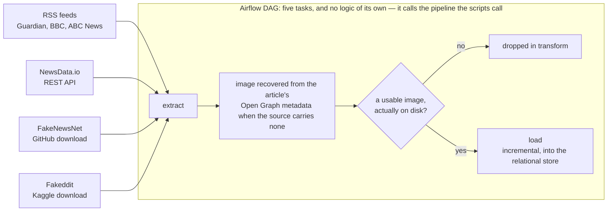
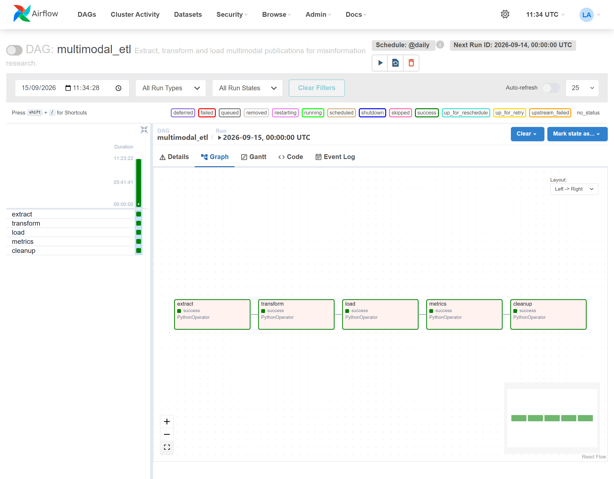
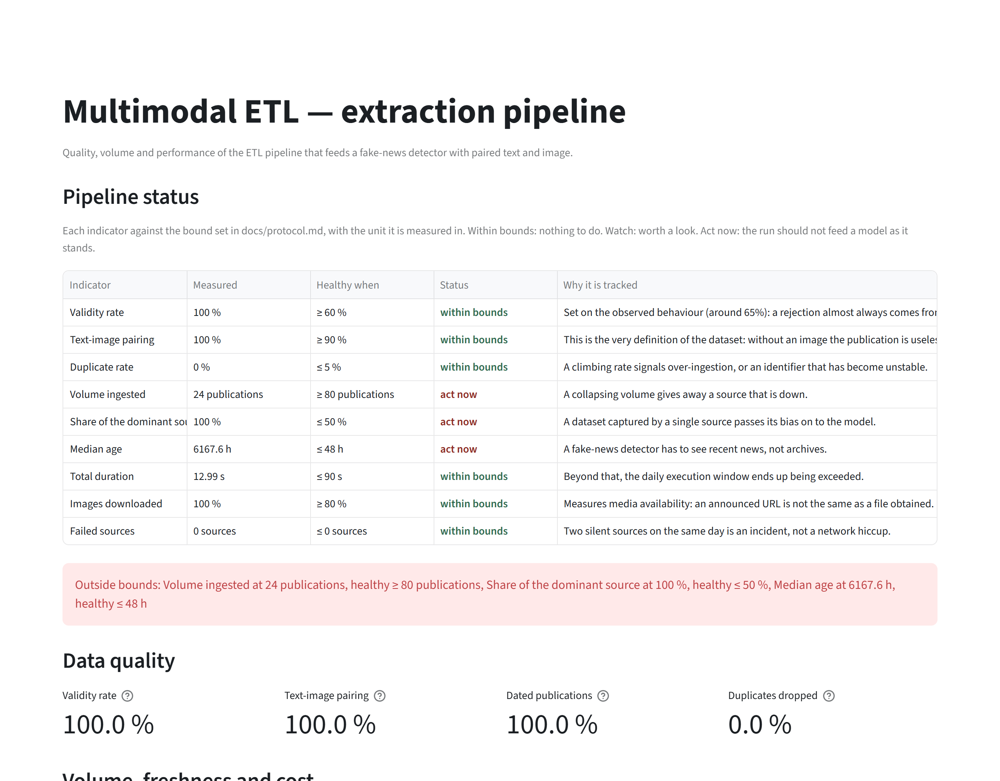
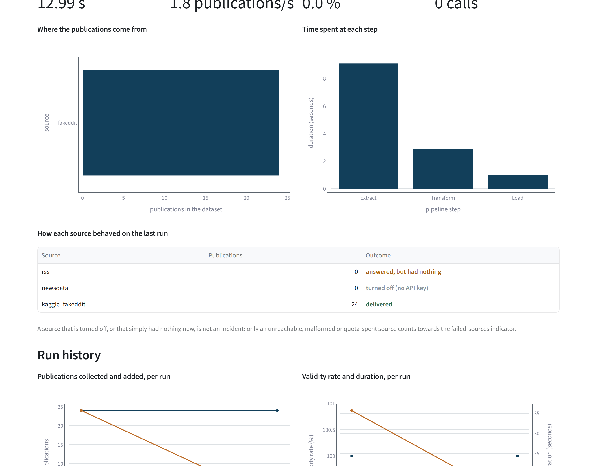

<h1 align="center">Multimodal ETL</h1>

<p align="center">Four live sources, one rule (no image on disk, no publication) and a pipeline whose every step replays alone</p>

<p align="center">
  
  
  
  
</p>

**Project status** — frozen, and still runnable. One command replays the whole chain against
live feeds, which is also why tomorrow's numbers will not be the ones on this page: what a run
reproduces is the pipeline, never the corpus. `reports/run-evidence.json` records the last time
that was checked end to end. The workflows lint, scan and test when they are started, and read no
source.

## The problem

A dataset for multimodal fake-news detection needs a text *and* an image for every row. Four
sources will each give you one of those reliably and the other only sometimes: RSS feeds carry
an image URL that may 404, FakeNewsNet publishes CSVs with no image at all, and an API can go
quiet the moment its quota runs out.

The tempting shortcut is to keep the row and record the URL. It produces a dataset that looks
complete and collapses the first time anyone tries to train on it, one dead link at a time.

So the rule this pipeline is built around is **no image on disk, no publication**. A URL is not
an image: every one is downloaded and opened by Pillow before the row is kept. That rule throws
work away, and most of the engineering below is the consequence: `transform` has to be able to
run again without `extract` running again, because rerunning `extract` costs a minute of
downloads and one call against the NewsData.io quota.

## What it does

Four sources, four access methods:

| Source | Access | What it brings |
|---|---|---|
| RSS feeds (The Guardian, BBC, ABC News) | `rss_feed` | volume and freshness |
| NewsData.io API | `rest_api` | structured news |
| FakeNewsNet | `github_download` | academic ground truth |
| Fakeddit | `kaggle_download` | annotated multimodal volume |

The FakeNewsNet CSVs carry no image, so the pipeline recovers one from the article's Open Graph
metadata. Publications without a usable image are dropped at the transform step.
[`docs/data-source.md`](docs/data-source.md) says why these four, and why the pipeline does
not scrape.

Five tasks, chained by an Airflow DAG that holds no logic of its own — it calls the same
`pipeline.py` the scripts do.



<!-- source: docs/images/MANIFEST.json -->


A Streamlit dashboard reads the run records and reports every indicator against the bound
[`docs/protocol.md`](docs/protocol.md) sets for it, and
[`docs/interface.md`](docs/interface.md) says what each of its sections shows.

<!-- source: docs/images/MANIFEST.json -->


### How it is built

**Airflow** orchestrates five `PythonOperator` tasks that call `pipeline.py` and hold no logic
of their own, so the same functions run from a script, from a notebook and from the DAG;
[`docs/architecture.md`](docs/architecture.md) says what that bought and what it cost.
**Docker** builds the image the orchestration runs in, under Airflow's own constraints file.

The collection is **feedparser** on the RSS feeds and **requests** everywhere else, with
**Beautiful Soup** and **lxml** reading the Open Graph metadata of the articles FakeNewsNet
indexes without an image, and **Pillow** opening every downloaded file before the row is kept.
**pandas** cleans and types the result, **PyArrow** writes it as **Parquet**, and **SQLAlchemy**
loads it into SQLite locally or **PostgreSQL** in a deployment: six tables, given field by
field in [`docs/DB.md`](docs/DB.md), whose primary keys are what makes a replay idempotent.

The dashboard is **Streamlit** and **Plotly**, painted from the same colours as the figures
and not from either library's defaults. Around all of it: **uv** for a locked environment, **Ruff** and
**Bandit** on each run, and a **pytest** suite in three tiers whose outermost one starts the
pipeline as a subprocess against an RSS feed it serves itself, then starts the dashboard with
the command quoted below and asks it for a page.

## The result

One run, through the Airflow DAG on 2026-09-15, against the four live sources with no
NewsData.io key, so that source turned itself off cleanly. Everything below is that run, n = 171
publications collected, and `docs/runbook.md` carries its transcript.

<!-- source: reports/data_quality.json -->
Of those n = 171, **127 were kept**. The 44 that fell away had no image file behind them, and
that single rule is the pipeline's reason for existing. **100 % of 127 pair a text with an image
file** on disk, and **22 % of 127 carry a ground-truth label**.

<!-- source: reports/indicators.json -->
All nine indicators of [`docs/protocol.md`](docs/protocol.md) were within their bounds, over
that same n = 171: **74.3 %** validity against a bound of 60, **94.9 %** of the announced image
URLs obtained against a bound of 80, **66.41 s** end to end against a bound of 90, and **0**
failed sources.

**The load cannot duplicate a row.** Idempotency is a property of the schema: the database
refuses the second copy, whichever writer got there first, and `docs/architecture.md` says why
that was worth a rewrite.

<!-- source: docs/runbook.md -->
The same DAG twice, back to back, over n = 171 collected each time. The first run kept 118 and
wrote all 118 to an empty database. The second kept 127, nine images that had failed to
download having succeeded on the retry, and wrote **9** of them. The other 118 were already
there, and the `source` table did not move at all.

A test proves the constraint holds even against a writer that bypasses the loader entirely and
issues its own `INSERT`.

**The tasks are independent.** `docs/runbook.md` shows a single task replayed on its own after
the working area had been emptied: it fell back to the last archived artefact and succeeded,
without replaying the extraction.

**A failing source does not stop the others.** Fifteen tests simulate a spent quota, a timeout,
a malformed answer, a truncated image, an oversized one and a network error mid-loop. Each
failure is also **qualified**, as `quota`, `network`, `malformed`, `empty` or `disabled`, and
only the first three count as incidents. A source turned off because no API key was supplied is
not an outage, and the dashboard says so where a red count would have lied.

<!-- source: docs/images/MANIFEST.json -->


<!-- source: reports/data_quality.json -->
**The deduplication key misses nothing here: measured, not assumed.** Two measures over the
n = 127 publications kept: those reachable through two URL variants, and one wire story
republished by two outlets. Both return **0** pairs. A test injects a realistic republication,
with tracking parameters, a `www.` prefix and the headline shouted, then checks the instrument
sees it, so the zero means "nothing there" and not "the measure is blind".

The key **is** fragile in principle: it hashes the exact URL and the exact title. It was left
alone because the measure gave no reason to change it, and rehashing would alter every
publication's identifier for a published before-and-after of 0 to 0. The measure also showed why
this corpus cannot exercise it: the four sources barely overlap, and two publishers carry the
same wire story under genuinely different URLs, which no URL normalisation reaches.

### What the dataset is actually worth

`reports/data_quality.md` is rendered by `scripts/quality_report.py` from
`reports/data_quality.json`. Its most useful line is not a headline number:

<!-- source: reports/data_quality.json -->
> Of the n = 127 publications kept, the 28 labelled ones average **56.1 characters** of text,
> against 383.5 for the 99 unlabelled.

Both annotated datasets ship a headline and nothing else, so the rows a classifier could be
fitted on are exactly the ones carrying the least text: train on this and you train on
headlines. A row count of 127 says none of that, which is why `reports/data_quality.json`
carries the two means and the report prints them next to each other.

## Why these numbers can be believed

Six things were wrong, and the first one is the reason the rest were worth looking for.

**The load step could not run.** `pipeline.py` imported `load.etape_chargement`, then declared
a local function under that same name. The declaration rebinds the module-level binding, so the
inner call landed on the pipeline's own function, which takes one argument where two were
passed:

```
TypeError: run_load() takes from 0 to 1 positional arguments but 2 were given
```

**The third task of the Airflow DAG could not complete**, and no test covered that path: every
test that existed exercised the modules in isolation, never the step that chains them. The
database looked healthy because it had been filled before the shadowing was introduced. A
populated database does not prove a pipeline works.

**Inside the container, the project root was wherever the process happened to start.** The
package finds its root by looking for `pyproject.toml` above itself, and a mount missing that
one file resolved it to `/opt/airflow`. Five green tasks, and a run that had written everywhere
except where it was supposed to. The compose file now states the root, because the container is
what knows it.

**A copy of the whole repository was committed inside itself.** A 72-file archive, purged from
the full history. The repository dropped to 491 KiB.

**The code was French and the documentation English.** 34 Python files out of 35 had French
docstrings, and the run records, the statistics files and three SQL tables used French keys. All
of it is now English — which is how the stale task names in the runbook came to light: it still
told the reader to run `airflow tasks test multimodal_etl transformation`, a task renamed to
`transform` some time earlier.

**The published report could not be reproduced.** It was recomputed from whatever dataset
happened to be on disk, so two readers on two machines got two different files from the same
command. Measuring and publishing are now separate steps: `--measure` writes the numbers of one
named run to `reports/data_quality.json`, and the default run renders the markdown from that
file alone.

Two further properties are asserted, not described. The bounds in `docs/protocol.md` are
not copied by hand — they live in `multimodal_etl.kpi.THRESHOLDS`, and a test asserts the
document names every one of them. The same goes for the schema: `schema.py` describes every
field, the diagram and the data dictionary are derived from it, and a test asserts they cover
every field. Add a column to `schema.py` and it reaches `docs/data_schema.mmd` and the
dictionary in `docs/DB.md` with nobody editing either.

## Running it

```powershell
uv sync --extra dev
uv run python scripts/run_etl.py            # the whole pipeline, one command
uv run streamlit run src/multimodal_etl/dashboard.py   # the dashboard
uv run python scripts/quality_report.py     # re-render reports/data_quality.md
```

No key is needed: the pipeline runs on the RSS feeds and a versioned Fakeddit sample. A
NewsData.io key turns on the fourth source; without one it disables itself and the run carries
on. Each step also runs on its own:

```powershell
uv run python scripts/run_extract.py
uv run python scripts/run_transform.py
uv run python scripts/run_load.py
```

A step replayed on its own falls back to the last archived artefact when the previous step's
working file has been cleared. Three variables steer a run without editing code:
`MULTIMODAL_ETL_DATA_DIR` moves everything it writes, `MULTIMODAL_ETL_SOURCES` selects the
connectors, `MULTIMODAL_ETL_RSS_FEEDS` points the feed reader elsewhere.

Airflow, locally — the full walkthrough is in [`docs/runbook.md`](docs/runbook.md):

```powershell
docker compose -f infra/docker-compose.airflow.yaml build
docker compose -f infra/docker-compose.airflow.yaml up -d
# http://localhost:8080, DAG: multimodal_etl
```

Checks:

```powershell
uv run python -m pytest      # 161 tests in three tiers
uv run ruff check .
uv run bandit -c pyproject.toml -r src
uv run python scripts/smoke.py    # run it end to end and write down that it ran
```

## Structure

```
├── src/multimodal_etl/
│   ├── config.py           paths and parameters, as frozen dataclasses
│   ├── schema.py           the publication schema — single source of truth
│   ├── sources/            one module per source, and the Open Graph enrichment
│   ├── images.py           download and validation of the images
│   ├── extract.py          step E: collect -> raw JSON + image files
│   ├── transform.py        step T: clean, validate, normalise
│   ├── load.py             step L: incremental relational load
│   ├── transit.py          working area between steps — what makes tasks independent
│   ├── pipeline.py         the five steps, called by the scripts AND by the DAG
│   ├── kpi.py              indicators, units and bounds
│   ├── dashboard.py        the Streamlit page
│   └── quality/            measurements on the dataset: duplicates, completeness
├── dags/                   the Airflow DAG — calls pipeline.py, holds no logic
├── infra/                  image and compose file for a local Airflow
├── docs/
│   ├── architecture.md     the engineering decisions, and what was left out
│   ├── data-source.md      the four sources, their terms, and the ones ruled out
│   ├── DB.md               the model, the dictionary and the six tables
│   ├── interface.md        what the dashboard shows, and the rules it follows
│   ├── protocol.md         every indicator, its bound, and what crossing it does
│   └── runbook.md          running the orchestration, and the logs of a real run
├── notebooks/              exploration, extraction, transformation, indicators
├── reports/                the data quality measures and the report rendered from them
├── scripts/                the pipeline, the diagram, the report, the captures, the smoke
└── tests/                  unit, integration, system
```

## What this does not prove

**Scale.** A few hundred publications reveal neither the memory behaviour, nor contention, nor
hash collisions. The pipeline demonstrates an architecture, not its resistance at scale.
Generating an artificial volume would measure a simulation, so it was not done.

**Concurrency in practice.** The database refuses a duplicate key, which is what makes concurrent
writers safe in principle. No test runs two loaders at once against the same database.

**That the sources stay reachable.** Every figure here depends on feeds that can change format or
disappear. `docs/protocol.md` names the indicator that would catch it, and the bounds are
calibrated on measured behaviour, not on wishes.

**That anything is watched.** Crossing a bound writes a log line and colours a row. There is no
alerting, no drift detection and nobody on call; `docs/protocol.md` separates what runs from what
a deployment would add.

## Licence and data

MIT, for the code.

**No third-party data is redistributed here.** The four sources are read at run time and each
keeps its own terms:

| Source | Access | Terms to observe |
|---|---|---|
| RSS feeds (The Guardian, BBC, ABC News) | public feeds | each publisher's terms of use; headlines and links only |
| NewsData.io | API key | the provider's API terms; no key is shipped |
| FakeNewsNet | download from its repository | its own research licence and citation |
| Fakeddit | download from its host | its own research licence and citation |

The only data file in the repository, `data/samples/fakeddit_sample.tsv`, is **synthetic**:
twenty-four made-up rows with the real column structure, and freely-licensed illustrations, so
the tests and the documentation can show the shape of a record without carrying anyone's content.
Every published screenshot and every smoke run is taken against it, for the same reason.
Images are downloaded into `data/` at run time and are not committed.

`reports/data_quality.json` holds counts, and never a headline or a URL: that is what lets the
published report be regenerated byte for byte while the corpus itself stays out of the repository.

A run therefore reproduces the pipeline, not the corpus. That is deliberate, and it is why the
figures on this page carry the date of the run that produced them.
