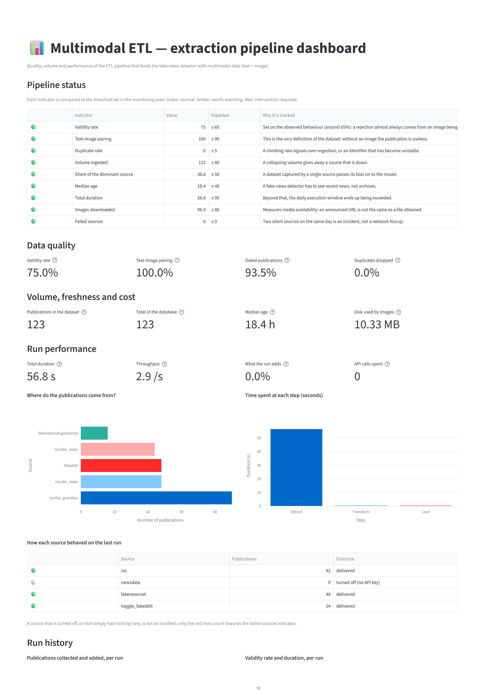

# Multimodal ETL

An ETL pipeline that collects **text-and-image publications** from four sources, cleans
them into a typed dataset, loads them into a relational database, and reports on itself.
Orchestrated by Apache Airflow, watched by a KPI dashboard.

The rule that defines the dataset: **no image on disk, no publication**. A URL is not an
image, so every image is downloaded and opened by Pillow before the publication is kept.



## Project status

**Deliberately finished.** This is a lab project: it was built to work end to end, it was
then audited, the defects the audit found were fixed, and the promises it made were
measured. It is not maintained beyond that, and its CI does not run on a schedule.

What that means concretely:

- the pipeline runs today, against live sources, with one command;
- the figures below come from a real run and are dated, because the sources are live news
  feeds — the same command tomorrow returns different numbers, and that is the point;
- what the pipeline claims is now either **proven** or **listed as unproven**. Both lists
  are below.

## What one run does

Four sources, four access methods:

| Source | Access | What it brings |
|---|---|---|
| RSS feeds (The Guardian, BBC, ABC News) | `rss_feed` | volume and freshness |
| NewsData.io API | `rest_api` | structured news |
| FakeNewsNet | `github_download` | academic ground truth |
| Fakeddit | `kaggle_download` | annotated multimodal volume |

The FakeNewsNet CSVs carry no image, so the pipeline recovers one from the article's Open
Graph metadata. Publications without a usable image are dropped at the transform step.

**One run, 2026-09-03** — no NewsData key, so that source turned itself off cleanly:

| | |
|---|---|
| Publications collected | 164 (RSS 92, FakeNewsNet 48, Fakeddit 24) |
| Kept after cleaning | 123 — the 41 dropped had no usable image |
| Text-image pairing | 100% |
| Images obtained | 96.9% of those attempted |
| of which recovered from Open Graph | 8 |
| Labelled with ground truth | 32 (26%) |
| Total duration | 56.8 s |

## What is proven

**The load cannot duplicate a row.** Every table is declared with its primary key and the
insert skips conflicts, so idempotency is a property of the **schema** rather than of the
code that happens to run first. Running the pipeline twice back to back:

| Run | Collected | Written | Total in database |
|---|---|---|---|
| first | 164 | 123 | 123 |
| second | 164 | **0** | 123 |

A test proves the constraint holds even against a writer that bypasses the loader entirely
and issues its own `INSERT`. An earlier version read the existing keys and then wrote the
rest — a race by construction, in a pipeline whose whole argument is that tasks can be
replayed.

**The tasks are independent.** `docs/airflow_run_evidence.md` shows a single task replayed
on its own after the working area had been emptied: it fell back to the last archived
artefact and succeeded, without replaying the extraction.

**A failing source does not stop the others.** Fifteen tests simulate a spent quota, a
timeout, a malformed answer, a truncated image, an oversized one and a network error
mid-loop. Each failure is also **qualified** — `quota`, `network`, `malformed`, `empty`,
`disabled` — and only the first three count as incidents. A source turned off because no
API key was supplied is not an outage, and the dashboard says so rather than showing a red
count.

**The deduplication key misses nothing here — measured, not assumed.** Two measures on the
123 collected publications: publications reachable through two URL variants, and one wire
story republished by two outlets. Both return **0 pairs**. A test injects a realistic
republication — tracking parameters, a `www.` prefix, the headline shouted — and checks the
instrument sees it, so the zero means "nothing there" rather than "the measure is blind".

The key **is** fragile in principle: it hashes the exact URL and the exact title. It was
left alone because the measure gave no reason to change it, and rehashing would alter every
publication's identifier for a published before/after of 0 → 0. The measure also showed why
this corpus cannot exercise it: the four sources barely overlap, and two publishers carry
the same wire story under genuinely different URLs — something no URL normalisation reaches.

## What the audit found

**The load step could not run.** `pipeline.py` imported `load.etape_chargement` and then
defined a function of the same name. In Python the definition rebinds the module-level
name, so the inner call resolved to the pipeline's own function, which takes one argument
instead of two:

```
TypeError: run_load() takes from 0 to 1 positional arguments but 2 were given
```

**The third task of the Airflow DAG could not complete**, and no test covered that path —
the 82 existing tests exercised the modules in isolation, never the pipeline step that
chains them. The database looked healthy because it had been filled before the shadowing
was introduced.

*Transferable lesson: a populated database does not prove a pipeline works.*

**A copy of the whole repository was committed inside itself.** A 72-file archive built for
submission, purged from the full history. The repository dropped to 491 KiB.

**The code was French and the documentation English.** 34 Python files out of 35 had French
docstrings, and the run records, the statistics files and three SQL tables used French
keys. All of it is now English — which is how the stale task names in the runbook came to
light: it still told the reader to run `airflow tasks test multimodal_etl transformation`,
a task that had been renamed to `transform`.

## What the dataset is actually worth

`reports/data_quality.md` is regenerated by `scripts/quality_report.py`. Its most useful
line is not a headline number:

> The 32 labelled publications average **54.9 characters** of text, against 361.5 for the
> unlabelled ones.

The labels come from FakeNewsNet and Fakeddit, which publish a headline and no article
body. The only rows usable for supervised training are also the textually poorest: a model
trained on this dataset would be learning from headlines. That is worth knowing before
using it, and a raw count of 123 rows would have hidden it.


## What this still does not prove

**Scale.** A few hundred publications reveal neither the memory behaviour, nor contention,
nor hash collisions. The pipeline demonstrates an architecture, not its resistance at scale.
Generating an artificial volume would measure a simulation, so it was not done.

**Concurrency in practice.** The database now refuses a duplicate key, which is what makes
concurrent writers safe in principle. No test runs two loaders at once against the same
database.

**That the sources stay reachable.** Every figure here depends on feeds that can change
format or disappear. The monitoring plan says which indicator would catch that, and the
thresholds are calibrated on measured behaviour rather than on wishes.

## Structure

```
├── src/multimodal_etl/
│   ├── config.py           # paths and parameters, as frozen dataclasses
│   ├── schema.py           # the publication schema — single source of truth
│   ├── sources/            # one module per source + the Open Graph enrichment
│   ├── images.py           # download and validation of the images
│   ├── extract.py          # step E: collect -> raw JSON + image files
│   ├── transform.py        # step T: clean, validate, normalise
│   ├── load.py             # step L: incremental relational load
│   ├── transit.py          # working area between steps (task independence)
│   ├── pipeline.py         # the 5 steps, called by the scripts AND by the DAG
│   ├── kpi.py              # indicators and alert thresholds
│   └── quality/            # measurements on the dataset: duplicates, completeness
├── dags/                   # the Airflow DAG — calls pipeline.py, holds no logic
├── docker/                 # image and compose file for a local Airflow
├── dashboard/              # the Streamlit application
├── notebooks/              # the steps, walked through one at a time
├── docs/                   # sources, schema, monitoring, run evidence
├── reports/                # the generated data quality report
└── tests/                  # 107 tests
```

The schema is generated from one place: `schema.py` describes every field, and the diagram,
the data dictionary and the table split are all derived from it. A field added to the code
appears everywhere else on its own.

## Running it

```powershell
uv sync --extra dev
uv run python scripts/run_etl.py            # the whole pipeline, one command
uv run streamlit run dashboard/app.py       # the KPI dashboard
uv run python scripts/quality_report.py     # regenerate reports/data_quality.md
```

No key is needed: the pipeline runs on the RSS feeds and a versioned Fakeddit sample.
A NewsData.io key turns on the fourth source; without one it disables itself and the run
carries on. Each step also runs on its own:

```powershell
uv run python scripts/run_extract.py
uv run python scripts/run_transform.py
uv run python scripts/run_load.py
```

A step replayed on its own falls back to the last archived artefact when the previous
step's working file has been cleared.

Airflow, locally — the full walkthrough is in `docs/airflow_runbook.md`:

```powershell
docker compose -f docker/docker-compose.airflow.yaml build
docker compose -f docker/docker-compose.airflow.yaml up -d
# http://localhost:8080, DAG: multimodal_etl
```

## Documentation

| Document | What it answers |
|---|---|
| [`docs/source_exploration.md`](docs/source_exploration.md) | Why these four sources, and why no scraping |
| [`docs/data_schema.md`](docs/data_schema.md) | The conceptual model and every field's role |
| [`docs/monitoring_plan.md`](docs/monitoring_plan.md) | Which indicators, which thresholds, and what happens when one is crossed |
| [`docs/airflow_runbook.md`](docs/airflow_runbook.md) | Running the orchestration yourself |
| [`docs/airflow_run_evidence.md`](docs/airflow_run_evidence.md) | The captured logs of a real DAG run |
| [`reports/data_quality.md`](reports/data_quality.md) | What fraction of the dataset is actually usable |

## Quality

```powershell
uv run python -m pytest      # 107 tests
uv run ruff check .
uv run bandit -c pyproject.toml -r src
```

The thresholds in the monitoring plan are not copied by hand: they live in
`multimodal_etl.kpi.THRESHOLDS`, and a test asserts the document names every one of them.
The same goes for the schema — a test asserts the data dictionary and the diagram cover
every field.

## Licence and data

MIT, for the code.

**No third-party data is redistributed here.** The four sources are read at run time and
each keeps its own terms:

| Source | Access | Terms to observe |
|---|---|---|
| RSS feeds (The Guardian, BBC, ABC News) | public feeds | each publisher's terms of use; headlines and links only |
| NewsData.io | API key | the provider's API terms; no key is shipped |
| FakeNewsNet | download from its repository | its own research licence and citation |
| Fakeddit | download from its host | its own research licence and citation |

The only data file in the repository, `data/samples/fakeddit_sample.tsv`, is **synthetic**:
twenty-five made-up rows with the real column structure, so the tests and the documentation
can show the shape of a record without carrying anyone's content. Images are downloaded
into `data/images/` at run time and are not committed.

A run therefore reproduces the pipeline, not the corpus. That is deliberate — the sources
are live, and the figures in this README are dated for the same reason.
