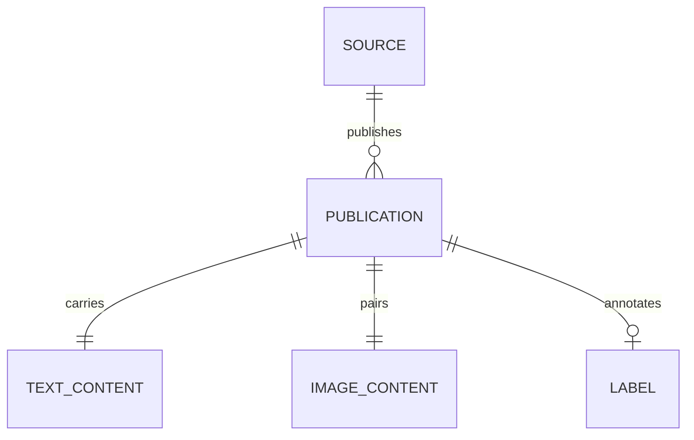
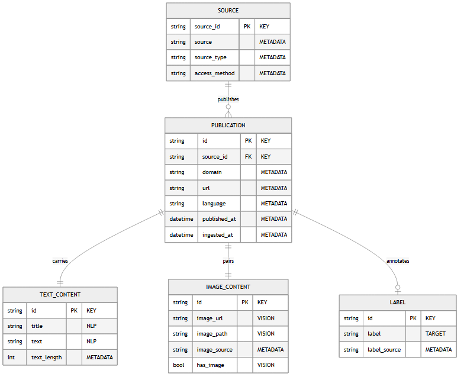

# The data model and the tables

What a publication is, field by field, and the six tables it is written to. The model is
**conceptual** first: it says what the data represents, independently of where it is stored.

This document, the diagram and the tables all come from `src/multimodal_etl/schema.py`, which
is the single source of truth. Declare a column there and it reaches the dictionary and the
picture unattended; `tests/integration/test_documentation.py` fails on the day one of them falls
behind.

## The entities

<!-- source: docs/images/MANIFEST.json -->

**PUBLICATION** sits at the heart of the model. It **carries a text** and **pairs an image**:
both relations have cardinality `1—1`, which is how the founding rule of the dataset is
written down: *no image, no publication*. A publication is **published by a source**, and may
be **annotated by a label**, with cardinality `0..1` since not every source provides one.

`docs/data_schema.mmd` is the Mermaid source, regenerated by
`uv run python scripts/build_schema_diagram.py`, which also renders the picture above and
records it in `docs/images/MANIFEST.json`.

## Field dictionary

### PUBLICATION

| Field | Type | Role | Required | Description |
|---|---|---|:---:|---|
| `id` | string | KEY | yes | Unique identifier: hash of the URL and the title. |
| `source_id` | string | KEY | yes | Join key towards SOURCE. |
| `domain` | string | METADATA | yes | Publisher's domain, a reliability signal. |
| `url` | string | METADATA | yes | Original URL: traceability and deduplication. |
| `language` | string | METADATA | yes | Language, ISO 639-1 code. |
| `published_at` | datetime | METADATA | no | Publication date, brought back to ISO 8601. |
| `ingested_at` | datetime | METADATA | yes | Ingestion timestamp, for traceability and monitoring. |

### SOURCE

| Field | Type | Role | Required | Description |
|---|---|---|:---:|---|
| `source_id` | string | KEY | yes | Primary key of the source. |
| `source` | string | METADATA | yes | Precise source: `rss:bbc_news`, `newsdata`, `fakenewsnet:politifact`… |
| `source_type` | string | METADATA | yes | Family: `rss`, `api` or `dataset`. |
| `access_method` | string | METADATA | yes | Access method: `rss_feed`, `rest_api`, `github_download`, `kaggle_download`. |

### TEXT_CONTENT

| Field | Type | Role | Required | Description |
|---|---|---|:---:|---|
| `title` | string | NLP | yes | Title, the main textual signal. |
| `text` | string | NLP | yes | Cleaned body or summary, the classification input. |
| `text_length` | integer | METADATA | yes | Length of the cleaned text: a feature and a quality check. |

### IMAGE_CONTENT

| Field | Type | Role | Required | Description |
|---|---|---|:---:|---|
| `image_url` | string | VISION | yes | Original URL of the image. |
| `image_path` | string | VISION | yes | **Path of the downloaded file**, the real input of the vision model. |
| `image_source` | string | METADATA | yes | `native` (supplied by the source) or `open_graph` (found on the page). |
| `has_image` | boolean | VISION | yes | True when the file is present on disk. |

### LABEL

| Field | Type | Role | Required | Description |
|---|---|---|:---:|---|
| `label` | string | TARGET | no | Ground truth: `real`, `fake` or `unverified`. |
| `label_source` | string | METADATA | no | Origin of the label, for instance `fakenewsnet:politifact`. |

## What the roles mean for the model downstream

- **NLP** (`title`, `text`): what the language model reads.
- **VISION** (`image_path`, `image_url`, `has_image`): what the visual model sees. It is
  `image_path` that counts: a URL can be dead, a file cannot.
- **TARGET** (`label`): the variable to predict, when it is available.
- **METADATA**: the reliability and freshness context, usable as secondary features and
  indispensable to the monitoring.
- **KEY** (`id`, `source_id`): the join keys between entities.

## How the text-image link is guaranteed

Three checks in a row, each more demanding than the last:

1. at **extraction**, the image is downloaded then **opened by Pillow**, so a URL that does not
   return a decodable image leaves no file behind;
2. at **transformation**, a publication only enters the dataset when its image file really is
   on disk (`require_image`);
3. in the **indicators**, the text-image pairing rate is read against the bound
   `docs/protocol.md` sets for it.

The boolean field `has_image` makes that guarantee readable straight from the data.

## From the conceptual model to the tables

One table per entity, joined by `id` and `source_id`. This is what
`src/multimodal_etl/load.py` produces.

| Entity | Table | Primary key | Foreign key |
|---|---|---|---|
| SOURCE | `source` | `source_id` | — |
| PUBLICATION | `publication` | `id` | `source_id` → `source` |
| TEXT_CONTENT | `text_content` | `id` | `id` → `publication` |
| IMAGE_CONTENT | `image_content` | `id` | `id` → `publication` |
| LABEL | `label` | `id` | `id` → `publication` |

One extra table, `publications`, holds the whole thing **flat**: it is the one consumed by
model training and by the dashboard, which have no need to join in order to read a complete
row.

## The engine, and what the schema is relied on for

SQLite locally, at `data/db/multimodal_etl.db`; any SQLAlchemy URL through
`MULTIMODAL_ETL_DB_URL`, which is how the same code writes to PostgreSQL. The tables are
created if absent at every load, which is what lets a fresh clone run without a migration
step.

**Each of the six tables carries a primary key, and every insert is written to skip a
conflict.** Replaying a run therefore adds nothing, and it is the engine that enforces it;
`docs/architecture.md` says why that distinction was worth a rewrite.
`tests/integration/test_load.py` writes straight to the engine, around the loader, and expects
`IntegrityError`.

## Credentials

No secret is hard-coded. The connection URL travels through `MULTIMODAL_ETL_DB_URL`, and
through a secret manager in production. In a deployment the application account is limited to
read and write on the pipeline's tables and is separate from the administrator account; TLS on
connections and encryption at rest are what a managed PostgreSQL offers by default.

The queries that build a table name validate it against the schema's table list before
executing, so no table name can come from outside input.
