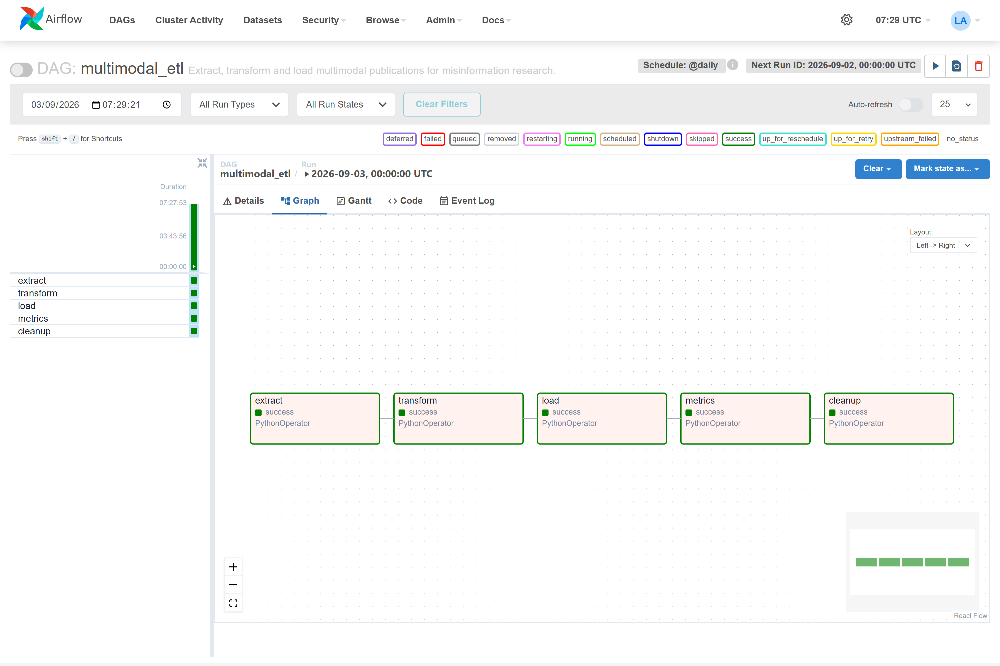

# Evidence of a DAG run in Apache Airflow

Captured logs of the `multimodal_etl` DAG.

Environment: Apache Airflow 2.10.4, `LocalExecutor`, PostgreSQL metadata database, image
built from `docker/Dockerfile`. The full procedure is in `docs/airflow_runbook.md`.

These transcripts are **captures**. The progress lines Airflow prints are kept, the debug
lines are dropped, and nothing is rewritten by hand: the file is regenerated by running the
DAG again.

---

## 1. The DAG loads, with no import error

```
$ airflow dags list
dag_id         | fileloc                                 | owners         | is_paused
===============+=========================================+================+==========
multimodal_etl | /opt/airflow/dags/multimodal_etl_dag.py | multimodal_etl | True

$ airflow dags list-import-errors
No data found

$ airflow tasks list multimodal_etl --tree
<Task(PythonOperator): extract>
    <Task(PythonOperator): transform>
        <Task(PythonOperator): load>
            <Task(PythonOperator): metrics>
                <Task(PythonOperator): cleanup>
```

Five distinct tasks, one per pipeline step.

---

## 2. A full run of the DAG

```
$ airflow dags test multimodal_etl 2026-09-03
```

```
multimodal_etl.pipeline   | === STEP 1 — EXTRACT ===
multimodal_etl.extract    | Extract: source 'rss' -> 92 publications
multimodal_etl.extract    | Extract: source 'newsdata' -> 0 publications
multimodal_etl.opengraph  | Open Graph: 14 images recovered across 40 articles visited
multimodal_etl.extract    | Extract: source 'fakenewsnet' -> 48 publications
multimodal_etl.extract    | Extract: source 'kaggle_fakeddit' -> 24 publications
multimodal_etl.extract    | Extract: 164 raw publications in total
multimodal_etl.images     | Images: 111 downloaded, 18 failures, 35 skipped (5.2 MB on disk)
multimodal_etl.extract    | Extract: 164 publications written to data/raw/raw_publications_20260903_072616.json
multimodal_etl.transit    | Working area: 'extraction.json' staged for the next step
Marking task as SUCCESS. task_id=extract

multimodal_etl.pipeline   | === STEP 2 — TRANSFORM ===
multimodal_etl.transform  | Transform: 109/164 publications valid after cleaning
multimodal_etl.transform  | Transform: 0 duplicates removed
multimodal_etl.transform  | Transform: dataset of 109 rows exported to data/processed/publications_20260903_072617.parquet
multimodal_etl.transit    | Working area: 'dataset.parquet' staged for the next step
Marking task as SUCCESS. task_id=transform

multimodal_etl.pipeline   | === STEP 3 — LOAD ===
multimodal_etl.load       | Load: 109 rows added to 'publication'
multimodal_etl.load       | Load: 5 rows added to 'source'
multimodal_etl.load       | Load: 109 rows added to 'text_content'
multimodal_etl.load       | Load: 109 rows added to 'image_content'
multimodal_etl.load       | Load: 18 rows added to 'label'
multimodal_etl.load       | Load: 109 rows added to 'publications'
multimodal_etl.load       | Load: 109 new publications, 0 already present
Marking task as SUCCESS. task_id=load

multimodal_etl.pipeline   | === STEP 4 — METRICS ===
multimodal_etl.pipeline   | Metrics: run record written to data/processed/runs/run_20260903_072617.json
Marking task as SUCCESS. task_id=metrics

multimodal_etl.pipeline   | === STEP 5 — CLEANUP ===
multimodal_etl.transit    | Working area: 5 temporary files deleted
Marking task as SUCCESS. task_id=cleanup

DagRun Finished: dag_id=multimodal_etl, run_id=manual__2026-09-03T00:00:00+00:00,
state=success, run_type=manual
```

All five tasks are `SUCCESS` and the `DagRun` ends `state=success`. Three of the four
sources contributed — NewsData.io was skipped, no API key — 111 images were downloaded, the
six tables of the relational model were populated, and the working area was emptied by the
last task.



---

## 3. One task replayed on its own

This is the point that justifies the orchestration: any task has to be replayable
independently of the others. The working area has just been emptied by `cleanup`, so
`transform` no longer has its input file.

```
$ airflow tasks test multimodal_etl transform 2026-09-03
```

```
airflow.task              | Executing <Task(PythonOperator): transform> on 2026-09-03
multimodal_etl.pipeline   | === STEP 2 — TRANSFORM ===
multimodal_etl.transit    | Working area: 'extraction.json' missing, falling back to archive raw_publications_20260903_072616.json
multimodal_etl.transform  | Transform: reading raw file data/raw/raw_publications_20260903_072616.json
multimodal_etl.transform  | Transform: 164 raw publications read
multimodal_etl.transform  | Transform: 109/164 publications valid after cleaning
multimodal_etl.transform  | Transform: dataset of 109 rows exported to data/processed/publications_20260903_072632.parquet
multimodal_etl.transit    | Working area: 'dataset.parquet' staged for the next step
Marking task as SUCCESS. task_id=transform
```

The task noticed its working file was gone, fell back to the last archived extraction, and
finished successfully — **without replaying the extraction**, which takes a minute and
spends an API call.

---

## 4. The load is incremental

A second run does not reload the same data:

```
$ airflow dags test multimodal_etl 2026-09-03
```

```
multimodal_etl.extract    | Extract: 164 raw publications in total
multimodal_etl.images     | Images: 120 downloaded, 7 failures, 37 skipped (8.9 MB on disk)
multimodal_etl.transform  | Transform: 118/164 publications valid after cleaning
multimodal_etl.load       | Load: 11 rows added to 'publication'
multimodal_etl.load       | Load: table 'source' already up to date
multimodal_etl.load       | Load: 11 rows added to 'text_content'
multimodal_etl.load       | Load: 11 rows added to 'image_content'
multimodal_etl.load       | Load: 9 rows added to 'label'
multimodal_etl.load       | Load: 11 rows added to 'publications'
multimodal_etl.load       | Load: 11 new publications, 107 already present
DagRun Finished: state=success
```

Of the 118 publications the second run kept, 107 were already in the database and 11 were
new — the articles the feeds had published in the ninety seconds between the two runs. The
`source` table did not move at all: the same five sources.

**What this shows, and what it does not.** It shows the incremental mechanism working. It
does not show idempotency holding under concurrency: the guarantee lives in application
code, which reads the existing keys and then writes. There is no unique constraint in the
database, so two runs overlapping — or a crash between the read and the write — would still
insert duplicates. Closing that is the first action of the level-3 plan.
