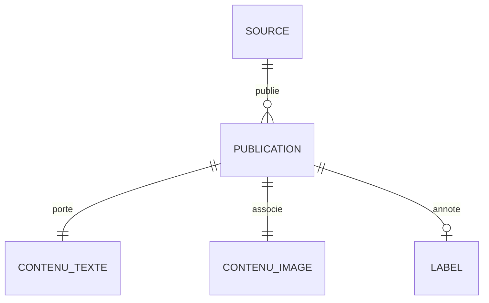

# Final data schema

The conceptual model of the multimodal dataset.

This document describes the **conceptual model**: the entities, what each field means and
what it is for in the AI use case. It is independent of the storage technology — it says
*what the data represents*, not how it is physically written to disk.

The diagram and this dictionary are generated from `src/multimodal_etl/schema.py`, which is
the single source of truth: adding a field to the code makes it appear everywhere. The
renderings are `data_schema.mmd`, `data_schema.png` and `data_schema.pdf`.

## 1. Conceptual model

**PUBLICATION** sits at the heart of the model. It **carries a text** and **pairs an
image**: both relations have cardinality `1—1`, which expresses the founding rule of the
dataset — *no image, no publication*. A publication is **published by a source** (a source
publishes several) and may be **annotated by a label**, with cardinality `0..1` since not
every source provides one.

## 2. Field dictionary

### PUBLICATION

| Field | Type | Role | Required | Description |
|---|---|---|:---:|---|
| `id` | string | KEY | yes | Unique identifier (hash of the URL and the title). |
| `source_id` | string | KEY | yes | Join key towards SOURCE. |
| `domain` | string | METADATA | yes | Publisher's domain — a reliability signal. |
| `url` | string | METADATA | yes | Original URL: traceability and deduplication. |
| `language` | string | METADATA | yes | Language, ISO 639-1 code. |
| `published_at` | datetime | METADATA | no | Publication date, brought back to ISO 8601. |
| `ingested_at` | datetime | METADATA | yes | Ingestion timestamp — traceability and monitoring. |

### SOURCE

| Field | Type | Role | Required | Description |
|---|---|---|:---:|---|
| `source_id` | string | KEY | yes | Primary key of the source. |
| `source` | string | METADATA | yes | Precise source: `rss:bbc_news`, `newsdata`, `fakenewsnet:politifact`… |
| `source_type` | string | METADATA | yes | Family: `rss`, `api` or `dataset`. |
| `access_method` | string | METADATA | yes | Access method: `flux_rss`, `api_rest`, `telechargement_github`, `telechargement_kaggle`. |

### CONTENU_TEXTE

| Field | Type | Role | Required | Description |
|---|---|---|:---:|---|
| `title` | string | NLP | yes | Title — the main textual signal. |
| `text` | string | NLP | yes | Cleaned body or summary — the classification input. |
| `text_length` | integer | METADATA | yes | Length of the cleaned text: a feature and a quality check. |

### CONTENU_IMAGE

| Field | Type | Role | Required | Description |
|---|---|---|:---:|---|
| `image_url` | string | VISION | yes | Original URL of the image. |
| `image_path` | string | VISION | yes | **Path of the downloaded file** — the real input of the vision model. |
| `image_source` | string | METADATA | yes | `native` (supplied by the source) or `open_graph` (found on the page). |
| `has_image` | boolean | VISION | yes | True when the file is present on disk. |

### LABEL

| Field | Type | Role | Required | Description |
|---|---|---|:---:|---|
| `label` | string | TARGET | no | Ground truth: `real`, `fake` or `unverified`. |
| `label_source` | string | METADATA | no | Origin of the label, for instance `fakenewsnet:politifact`. |

## 3. The roles, and what they mean for the model

- **NLP** (`title`, `text`) — what the language model reads.
- **VISION** (`image_path`, `image_url`, `has_image`) — what the visual model sees. It is
  `image_path` that counts: a URL can be dead, a file cannot.
- **TARGET** (`label`) — the variable to predict, when it is available.
- **METADATA** — the reliability and freshness context, usable as secondary features and
  indispensable to the monitoring.
- **KEY** (`id`, `source_id`) — the join keys between entities.

## 4. How the text-image link is guaranteed

Three checks in a row, each more demanding than the last:

1. at **extraction**, the image is downloaded then **opened by Pillow** — a URL that does
   not return a decodable image leaves no file behind;
2. at **transformation**, a publication only enters the dataset when its image file really
   is on disk (`require_image`);
3. in the **KPIs**, the text-image pairing rate is tracked continuously and raises an alert
   below 90%.

The boolean field `has_image` makes that guarantee readable straight from the data.

## 5. From the conceptual model to the tables

The conceptual model above translates into one table per entity, joined by `id` and
`source_id` — this is what `src/multimodal_etl/load.py` produces:

| Entity | Table | Primary key | Foreign key |
|---|---|---|---|
| SOURCE | `source` | `source_id` | — |
| PUBLICATION | `publication` | `id` | `source_id` → `source` |
| CONTENU_TEXTE | `contenu_texte` | `id` | `id` → `publication` |
| CONTENU_IMAGE | `contenu_image` | `id` | `id` → `publication` |
| LABEL | `label` | `id` | `id` → `publication` |

One extra table, `publications`, holds the whole thing **flat**: it is the one consumed by
model training and by the dashboard, which have no need to join in order to read a
complete row.
