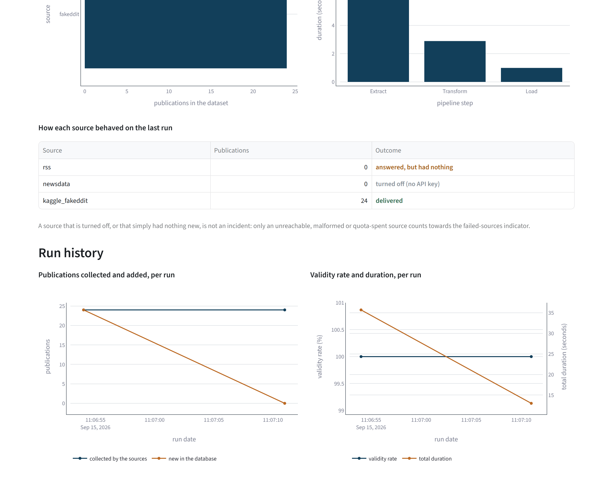

# The dashboard

What the Streamlit page shows, who it is for, and the rules it follows. The indicators
themselves, what each one measures and the bound it is read against, are defined in
`docs/protocol.md`; this document is about the surface.

```powershell
uv run streamlit run src/multimodal_etl/dashboard.py
```

It reads the artefacts the pipeline left behind: the latest dataset under `data/processed/`,
the statistics written beside it, and one record per run under `data/processed/runs/`. It
trains nothing, recomputes nothing and writes nothing. With no dataset on disk it says so, and
names the command that produces one.

## Who reads it

Whoever has to decide whether the last run's output can feed a model. That is not necessarily
the person who wrote the pipeline, so nothing on the page assumes the code has been read. A
unit sits beside every figure, each bound says which side of it is the healthy one, and the
reason an indicator exists at all is in the row with it.

## Seven sections, in the order the questions come

| Section | The question it answers |
|---|---|
| Pipeline status | Is anything outside the bounds `docs/protocol.md` sets |
| Data quality | What survived the cleaning, and how much of it is usable |
| Volume, freshness and cost | How much there is, how old it is, what it took |
| Run performance | How long the run took, and what it added |
| Where the publications come from | Is the dataset concentrated on one source |
| How each source behaved | Which sources delivered, and why the others did not |
| Run history | Is anything drifting, over the runs so far |
| What the pipeline produces | The rows and the image files themselves |

## Three rules the page follows

**A status is never carried by colour alone.** Each row of the status table carries the word,
`within bounds`, `watch` or `act now`, and the colour repeats it. A reader who cannot separate
the three hues reads the same table.

<!-- source: docs/images/MANIFEST.json -->


**A number carries its unit.** `≤ 48` left the reader to guess between hours, days and
publications. The unit lives on the threshold itself, in `multimodal_etl.kpi.Threshold`, so
the card, the table and the alert banner cannot disagree about it.

**A silent source says why it is silent.** The outcome column distinguishes a source that
delivered, one turned off for want of a key, one that answered with nothing, and one that is
genuinely down. Only the last kind counts towards the failed-sources indicator.

<!-- source: docs/images/MANIFEST.json -->


## Two quantities never share an axis

The run history draws the validity rate as a percentage and the total duration in seconds. On
a single axis the percentage flattens against the baseline as soon as a run takes more than a
hundred seconds, and the chart stops saying anything about the rate. Each quantity has its own
axis, and each axis is labelled with what it carries.

<!-- source: docs/images/MANIFEST.json -->


## The theme is the repository's, not Streamlit's

`.streamlit/config.toml` carries the page's colours, and `tests/unit/test_theme.py`
checks them against `multimodal_etl.figure_style`, which is what the charts read. Without
that file the page ships Streamlit's factory red on its buttons next to charts drawn in blue
and amber, and the editor toolbar, `Deploy` and the three-dot menu, appears in every
screenshot.

Plotly inherits none of it: each chart sets its own background, font colour and grid from the
same palette module. Nothing in `dashboard.py` writes a colour.

## What the published screenshots were taken against

Not a live run. `scripts/capture.py` builds its own corpus first: two runs of the pipeline on
the versioned Fakeddit sample, with NewsData.io given no key and the feed reader pointed at a
port where nothing listens. It then starts the dashboard against that corpus and photographs
three sections. `docs/images/MANIFEST.json` records, for each image, the state it was taken in
and the command that retakes it.

The demonstration sample is twenty-four rows dated the first of January, so three indicators
sit outside their bounds in the status capture. That is the page doing its job, and the reason
the capture is worth publishing at all.
