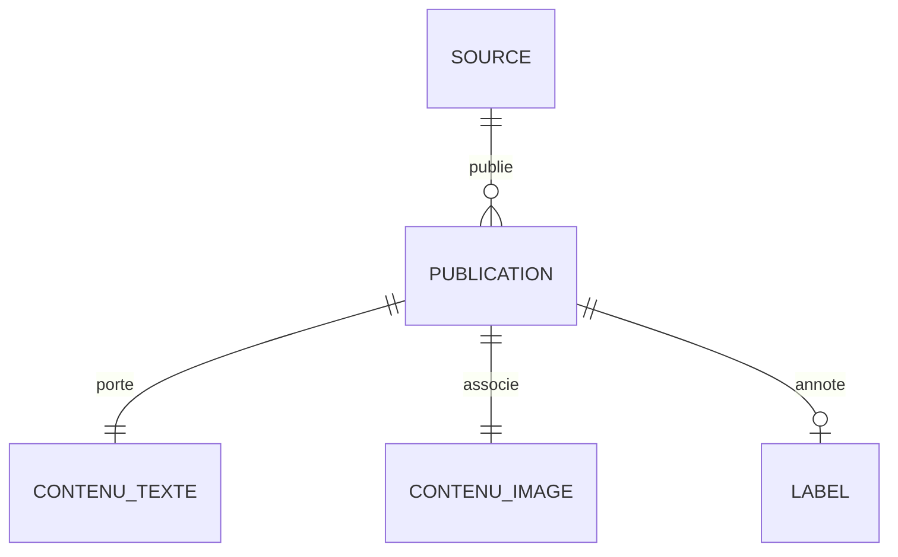

# Schéma de données finalisé

modèle conceptuel du jeu de données multimodal.

Ce document décrit le **modèle conceptuel** : les entités, ce que chaque champ signifie
et à quoi il sert dans le cas d'usage IA. Il est indépendant de la technologie de
stockage — il dit *ce que représentent* les données, pas comment elles sont physiquement
écrites sur disque.

Le diagramme et ce dictionnaire sont générés depuis `src/multimodal_etl/schema.py`, qui est la
source unique de vérité : ajouter un champ au code le fait apparaître partout.
Le rendu est dans `schema_donnees.mmd`, `schema_donnees.png` et `schema_donnees.pdf`.

## 1. Modèle conceptuel

**PUBLICATION** est au cœur du modèle. Elle **porte un texte** et **associe une image** :
ces deux relations sont en cardinalité `1—1`, ce qui exprime la règle fondatrice du jeu
de données — *pas d'image, pas de publication*. Une publication est **publiée par une
source** (une source en publie plusieurs) et peut être **annotée par un label**, en
cardinalité `0..1` puisque toutes les sources n'en fournissent pas.

## 2. Dictionnaire des champs

### PUBLICATION

| Champ | Type | Rôle | Obligatoire | Description |
|---|---|---|:---:|---|
| `id` | string | KEY | oui | Identifiant unique (empreinte de l'URL et du titre). |
| `source_id` | string | KEY | oui | Clé de jointure vers SOURCE. |
| `domain` | string | METADATA | oui | Domaine de l'éditeur — signal de fiabilité. |
| `url` | string | METADATA | oui | URL d'origine : traçabilité et déduplication. |
| `language` | string | METADATA | oui | Langue, code ISO 639-1. |
| `published_at` | datetime | METADATA | non | Date de publication, ramenée en ISO 8601. |
| `ingested_at` | datetime | METADATA | oui | Horodatage d'ingestion — traçabilité et monitoring. |

### SOURCE

| Champ | Type | Rôle | Obligatoire | Description |
|---|---|---|:---:|---|
| `source_id` | string | KEY | oui | Clé primaire de la source. |
| `source` | string | METADATA | oui | Source précise : `rss:bbc_news`, `newsdata`, `fakenewsnet:politifact`… |
| `source_type` | string | METADATA | oui | Famille : `rss`, `api` ou `dataset`. |
| `access_method` | string | METADATA | oui | Méthode d'accès : `flux_rss`, `api_rest`, `telechargement_github`, `telechargement_kaggle`. |

### CONTENU_TEXTE

| Champ | Type | Rôle | Obligatoire | Description |
|---|---|---|:---:|---|
| `title` | string | NLP | oui | Titre — signal textuel principal. |
| `text` | string | NLP | oui | Corps ou résumé nettoyé — entrée de la classification. |
| `text_length` | integer | METADATA | oui | Longueur du texte nettoyé : feature et contrôle qualité. |

### CONTENU_IMAGE

| Champ | Type | Rôle | Obligatoire | Description |
|---|---|---|:---:|---|
| `image_url` | string | VISION | oui | URL d'origine de l'image. |
| `image_path` | string | VISION | oui | **Chemin du fichier téléchargé** — l'entrée réelle du modèle vision. |
| `image_source` | string | METADATA | oui | `native` (fournie par la source) ou `open_graph` (retrouvée sur la page). |
| `has_image` | boolean | VISION | oui | Vrai si le fichier est présent sur disque. |

### LABEL

| Champ | Type | Rôle | Obligatoire | Description |
|---|---|---|:---:|---|
| `label` | string | TARGET | non | Vérité terrain : `real`, `fake` ou `unverified`. |
| `label_source` | string | METADATA | non | Origine du label, par exemple `fakenewsnet:politifact`. |

## 3. Les rôles, et ce qu'ils veulent dire pour le modèle

- **NLP** (`title`, `text`) — ce que lit le modèle de langage.
- **VISION** (`image_path`, `image_url`, `has_image`) — ce que voit le modèle visuel.
  C'est `image_path` qui compte : une URL peut être morte, un fichier ne l'est pas.
- **TARGET** (`label`) — la variable à prédire, quand elle est disponible.
- **METADATA** — le contexte de fiabilité et de fraîcheur, exploitable comme features
  secondaires et indispensable au monitoring.
- **KEY** (`id`, `source_id`) — les clés de jointure entre les entités.

## 4. Comment le lien texte-image est garanti

Trois contrôles successifs, chacun plus exigeant que le précédent :

1. à l'**extraction**, l'image est téléchargée puis **ouverte par Pillow** — une URL qui
   ne renvoie pas une image décodable ne laisse aucun fichier derrière elle ;
2. à la **transformation**, une publication n'entre dans le jeu de données que si son
   fichier image est effectivement présent sur le disque (`require_image`) ;
3. dans les **KPI**, le taux d'association texte-image est suivi en continu et déclenche
   une alerte sous 90 %.

Le champ booléen `has_image` rend cette garantie lisible directement dans les données.

## 5. Du modèle conceptuel aux tables

Le modèle conceptuel ci-dessus se traduit en base par une table par entité, reliées par
`id` et `source_id` — c'est ce que produit `src/multimodal_etl/load.py` :

| Entité | Table | Clé primaire | Clé étrangère |
|---|---|---|---|
| SOURCE | `source` | `source_id` | — |
| PUBLICATION | `publication` | `id` | `source_id` → `source` |
| CONTENU_TEXTE | `contenu_texte` | `id` | `id` → `publication` |
| CONTENU_IMAGE | `contenu_image` | `id` | `id` → `publication` |
| LABEL | `label` | `id` | `id` → `publication` |

Une table supplémentaire `publications` reprend l'ensemble **à plat** : c'est celle que
consomment l'entraînement du modèle et le tableau de bord, qui n'ont pas besoin de faire
des jointures pour lire une ligne complète.
