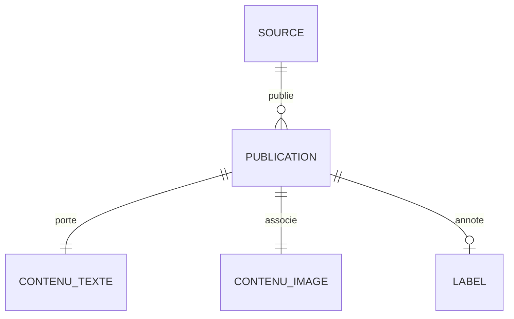

# Schéma de données finalisé — CheckItAI

**Livrable n°4** — Modèle conceptuel du jeu de données multimodal.

Ce document décrit le **modèle conceptuel** des données produites par le pipeline
(les champs, leurs types et leur rôle dans le cas d'usage IA). Il est **indépendant
de toute technologie de stockage** : il décrit la *signification* des données, pas
leur implémentation physique (tables, index, clés SQL).

Le diagramme correspondant est dans `schema_donnees.mmd` (rendus `schema_donnees.png`
et `schema_donnees.pdf`). Diagramme et dictionnaire sont générés depuis la source
unique de vérité `src/checkitai/schema.py`.

## 1. Diagramme conceptuel (aperçu)

Le cœur du modèle est l'entité **PUBLICATION**. Chaque publication **porte un texte**
et **associe une image** : ces deux relations en cardinalité `1—1` (`||--||`)
**garantissent le lien texte-image** exigé par le cas d'usage multimodal. Une
publication est **publiée par une source** et peut être **annotée par un label**
(0 ou 1, car toutes les sources ne fournissent pas de vérité terrain).

## 2. Dictionnaire des champs

| Champ | Type | Rôle | Obligatoire | Description |
|---|---|---|:---:|---|
| `id` | string | **KEY** | ✅ | Identifiant unique (hash SHA-1 de l'URL + titre). |
| `source` | string | METADATA | ✅ | Source précise (ex. `rss:bbc_news`, `newsdata`, `fakenewsnet:politifact`). |
| `source_type` | string | METADATA | ✅ | Famille de source : `rss`, `api` ou `dataset`. |
| `title` | string | **NLP** | ✅ | Titre — signal textuel principal pour le modèle NLP. |
| `text` | string | **NLP** | ✅ | Corps/résumé nettoyé — entrée texte de la classification. |
| `url` | string | METADATA | ✅ | URL d'origine (traçabilité, déduplication). |
| `image_url` | string | **VISION** | ✅ | URL de l'image principale — entrée visuelle du modèle. |
| `published_at` | datetime | METADATA | ⬜ | Date de publication (ISO 8601). |
| `language` | string | METADATA | ✅ | Langue (code ISO 639-1, ex. `en`). |
| `domain` | string | METADATA | ✅ | Domaine de l'éditeur (signal de fiabilité). |
| `label` | string | **TARGET** | ⬜ | Vérité terrain : `real`, `fake` ou `unverified`. |
| `label_source` | string | METADATA | ⬜ | Origine du label (ex. `fakenewsnet:politifact`). |
| `has_image` | boolean | **VISION** | ✅ | Vrai si une image valide est associée (lien texte-image). |
| `text_length` | integer | METADATA | ✅ | Longueur du texte nettoyé (feature + contrôle qualité). |
| `ingested_at` | datetime | METADATA | ✅ | Horodatage d'ingestion (traçabilité, monitoring). |

## 3. Rôles dans le cas d'usage IA

- **NLP** (`title`, `text`) : entrées du modèle de langage qui analyse le contenu
  textuel.
- **VISION** (`image_url`, `has_image`) : entrée du modèle visuel ; `has_image`
  matérialise et garantit l'association texte-image.
- **TARGET** (`label`) : variable cible pour l'apprentissage supervisé du détecteur
  de fake news.
- **METADATA** : contexte de fiabilité et de fraîcheur (source, domaine, dates),
  exploitable comme features secondaires et pour le monitoring.

## 4. Garantie du lien texte-image

Le pipeline n'écrit une publication dans le dataset final que si elle possède **un
texte exploitable** (longueur ≥ seuil) **et** **une image valide** (mode multimodal
strict, paramètre `require_image`). Le champ booléen `has_image` rend cette garantie
explicite et vérifiable dans les données comme dans les KPI (taux d'association
texte-image).
